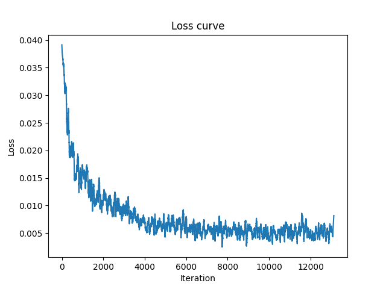
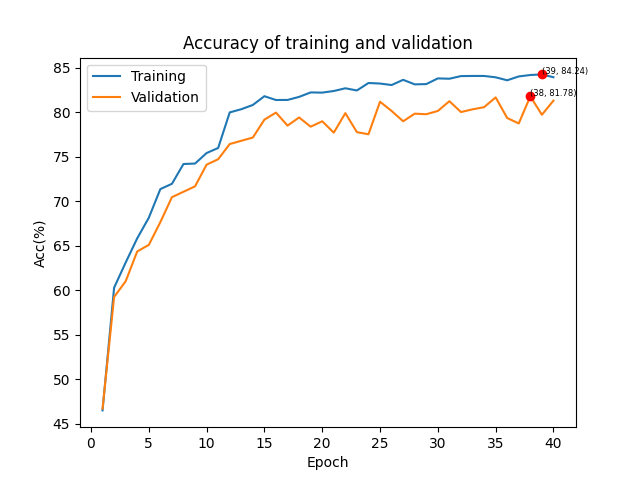
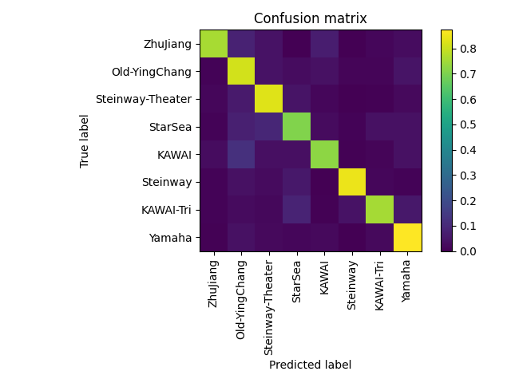

# Piano-Classification

Classify piano sound quality by fine-tuned pre-trained models.

## Usage

### Code download

```
git clone https://github.com/george-chou/Piano-Classification.git
cd Piano-Classification
```
### Dataset download

Download at <https://github.com/george-chou/Piano-Classification/releases/download/v0.1/audio.zip> and extract it into the project directory.

### Train
Assign a backbone after `--model` to start training:
```
python train.py --model inception_v3
```

__Supported backbones__
| Ver                | Type       |
| :----------------- | :--------- |
| alexnet            | AlexNet    |
| vgg11              | VGG        |
| vgg13              | VGG        |
| vgg16              | VGG        |
| vgg19              | VGG        |
| vgg11_bn           | VGG        |
| vgg13_bn           | VGG        |
| vgg16_bn           | VGG        |
| vgg19_bn           | VGG        |
| resnet18           | ResNet     |
| resnet34           | ResNet     |
| resnet50           | ResNet     |
| resnet101          | ResNet     |
| resnet152          | ResNet     |
| resnext50_32x4d    | ResNet     |
| resnext101_32x8d   | ResNet     |
| wide_resnet50_2    | ResNet     |
| wide_resnet101_2   | ResNet     |
| squeezenet1_0      | SqueezeNet |
| squeezenet1_1      | SqueezeNet |
| densenet121        | DenseNet   |
| densenet169        | DenseNet   |
| densenet201        | DenseNet   |
| densenet161        | DenseNet   |
| inception_v3       | Inception  |
| googlenet          | GoogleNet  |
| shufflenet_v2_x0_5 | ShuffleNet |
| shufflenet_v2_x1_0 | ShuffleNet |
| mobilenet_v2       | MobileNet  |
| mnasnet0_5         | MobileNet  |
| mnasnet1_0         | MobileNet  |

### Plot results
After finishing the training, use below command to plot latest results:
```
python plot.py
```

### Predict
Use below command to predict an audio target by latest saved model:
```
python eval.py --target ./test/KAWAI.wav
```

## Results
A demo result of AlexNet fine-tuning:
|  |    |  |
| :-----------------------------: | :------------------------------: | :----------------------------: |
|           Loss curve            | Training and validation accuracy |        Confusion matrix        |
